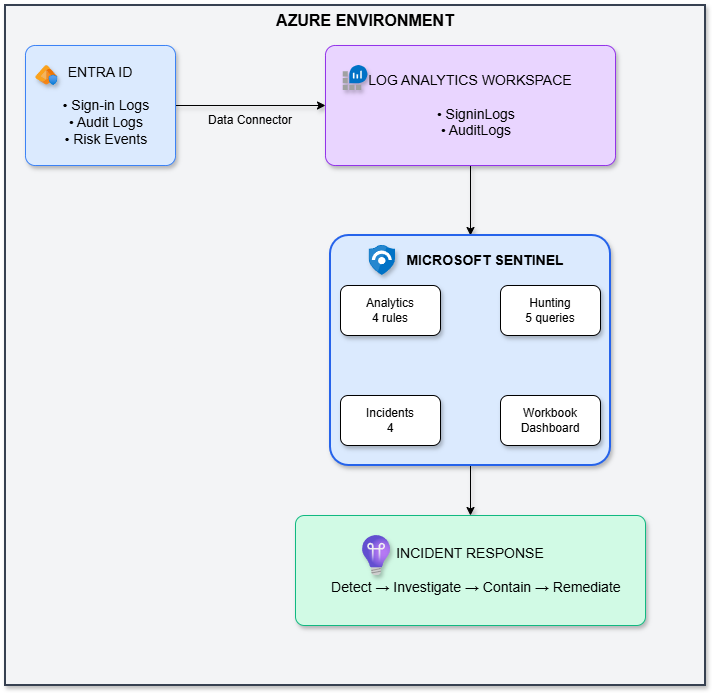

# Azure Sentinel Incident Response Simulation

## Overview

A comprehensive Security Operations Center (SOC) simulation demonstrating incident detection, investigation, and response using Microsoft Sentinel SIEM.

## What I Built

- ✅ Microsoft Sentinel deployment and configuration
- ✅ Entra ID log ingestion (sign-in, audit, risk logs)
- ✅ 4 custom KQL analytics rules for threat detection
- ✅ 5 KQL hunting queries
- ✅ Security monitoring dashboard (Workbook)
- ✅ Simulated account compromise attack
- ✅ Full incident investigation and response
- ✅ MITRE ATT&CK mapping

## Architecture


<!---
```
┌─────────────────────────────────────────────────────────────────────┐
│                         AZURE ENVIRONMENT                           │
├─────────────────────────────────────────────────────────────────────┤
│                                                                     │
│  ┌─────────────────┐         ┌─────────────────────────────────┐   │
│  │  ENTRA ID       │         │  LOG ANALYTICS WORKSPACE        │   │
│  │                 │         │                                 │   │
│  │ • Users         │────────▶│  • SigninLogs                  │   │
│  │ • Groups        │  Data   │  • AuditLogs                    │   │
│  │ • Sign-ins      │ Connector│                                │   │
│  │ • Audit Events  │         │                                 │   │
│  └─────────────────┘         └────────────┬────────────────────┘   │
│                                           │                        │
│                                           ▼                        │
│                              ┌─────────────────────────────────┐   │
│                              │     MICROSOFT SENTINEL          │   │
│                              │                                 │   │
│                              │  • Analytics Rules              │   │
│                              │  • Hunting Queries              │   │
│                              │  • Workbooks                    │   │
│                              │  • Incidents                    │   │
│                              └─────────────────────────────────┘   │
│                                                                    │
└────────────────────────────────────────────────────────────────────┘
```
--->
## Detection Rules Created

| Rule | Detects | Severity | MITRE |
|------|---------|----------|-------|
| Suspicious Sign-in from New Device | New browser/OS combination | Medium | T1078 |
| Multiple Failed Sign-in Attempts | Brute force attacks | High | T1110 |
| New User Account Created | Persistence mechanisms | Medium | T1136 |
| User Added to Privileged Role | Privilege escalation | High | T1078 |

## Attack Simulation

Simulated a complete attack chain:

1. **Initial Access** - Sign-in from new device (detected ✅)
2. **Credential Access** - Brute force attempts (detected ✅)
3. **Persistence** - Rogue account creation (detected ✅)
4. **Privilege Escalation** - Admin role assignment (detected ✅)

## Incidents Generated

| Incident | Severity | Status |
|----------|----------|--------|
| Suspicious Sign-in from New Device | Medium | Resolved ✅ |
| Multiple Failed Sign-in Attempts | High | Resolved ✅ |
| New User Account Created | Medium | Resolved ✅ |
| User Added to Privileged Role | High | Resolved ✅ |

## Skills Demonstrated

| Skill | Evidence |
|-------|----------|
| Microsoft Sentinel | Deployed and configured SIEM |
| KQL | Created custom detection rules and hunting queries |
| Incident Response | Investigated and resolved 4 security incidents |
| Detection Engineering | Built and troubleshot analytics rules |
| Log Analysis | Analyzed sign-in and audit logs |
| MITRE ATT&CK | Mapped techniques to framework |
| Troubleshooting | Fixed rule logic issues during implementation |

## Key Technical Challenges Solved

1. **Empty DeviceId Issue** - Browser sign-ins often have empty deviceId; rewrote rule to use Browser+OS combination instead
2. **Nested Role Name** - Role assignments store role name in modifiedProperties array; used mv-expand to extract
3. **Log Ingestion Delays** - Learned that Sentinel logs take 5-30 minutes to appear; adjusted testing approach
4. **UEBA Dependencies** - Many built-in rules require UEBA; created custom rules as alternative

## MITRE ATT&CK Coverage

| Tactic | Technique | Detection |
|--------|-----------|-----------|
| Initial Access | T1078 - Valid Accounts | Suspicious Sign-in Rule |
| Credential Access | T1110 - Brute Force | Failed Sign-ins Rule |
| Persistence | T1136 - Create Account | New User Rule |
| Privilege Escalation | T1078 - Valid Accounts | Privileged Role Rule |

## Documentation

- [Sentinel Setup Guide](docs/01-sentinel-setup.md)
- [Detection Rules](docs/02-detection-rules.md)
- [Hunting Queries](docs/03-hunting-queries.md)
- [Incident Report](docs/04-incident-report.md)
- [Lessons Learned](docs/05-lessons-learned.md)
- [Troubleshooting Guide](docs/06-troubleshooting.md)

## Technologies Used

- Microsoft Sentinel
- Microsoft Entra ID
- Kusto Query Language (KQL)
- Log Analytics Workspace
- MITRE ATT&CK Framework

## Author

**Amogh Karankal**
- LinkedIn: [linkedin.com/in/amoghkarankal](https://linkedin.com/in/amoghkarankal)
- GitHub: [github.com/Amogh-Karankal](https://github.com/Amogh-Karankal)

## Related Projects

- [Azure Identity & Access Management Project](https://github.com/Amogh-Karankal/azure-identity-management-project)
